<!--
  🧛 DRACULA THEMED README · Frontend-focused
  Palette: #282a36 #44475a #f8f8f2 #6272a4 #8be9fd #50fa7b #ffb86c #ff79c6 #bd93f9 #ff5555 #f1fa8c
-->

<div align="center">

<!-- ===== HEADER ===== -->


<!-- ===== TYPING ANIMATION ===== -->
<a href="https://aungkaungmyat-portfolio.vercel.app/">
  
</a>

<br/>

<!-- ===== BADGES ===== -->


<br/><br/>

<!-- ===== SOCIAL LINKS ===== -->
<a href="https://aungkaungmyat-portfolio.vercel.app/"></a>
<a href="https://www.linkedin.com/in/aung-kaung-myat-b41200242/"></a>
<a href="https://github.com/akm-coding"></a>
<a href="mailto:aungkaungmyat.developer@gmail.com"></a>

</div>

<br/>

<!-- ===== ABOUT ===== -->
##  &nbsp;`whoami`

```yaml
name:        Aung Kaung Myat
location:    Chiang Mai, Thailand 🇹🇭
role:        Frontend Developer @ Geek Squad Studio (Bangkok)
strengths:   React · Next.js · React Native · TypeScript
learning:    AWS · DevOps · Infrastructure · Solutions Architecture
goal:        Become a Cloud Solutions Architect ☁️
mantra:      "Great UX is invisible. Great infra should be too."
```

I'm a **frontend developer** who's spent the last few years crafting interfaces — from **5 banking apps** with biometric auth to e-learning platforms, on-demand services, and CMS dashboards. React, Next.js, and React Native are home for me.

Now I'm leveling up the stack underneath. I'm deep into **AWS, DevOps, and infrastructure** because I want to own more of the system — from the pixel the user taps to the container it runs on. The goal: **Solutions Architect**.

- 🎨 **Building:** Pixel-perfect, accessible, performant UIs in React/Next.js
- 📐 **Studying:** AWS architecture · Docker · CI/CD · IaC · System design
- 🎯 **Goal 2026:** AWS Solutions Architect certification
- 💬 **Ask me about:** React Native, frontend performance, design systems

<br/>

<!-- ===== TECH STACK ===== -->
##  &nbsp;`tech.stack`

<div align="center">

**`🎨 Frontend & Mobile — my home base`**


**`☁️ Cloud, DevOps & Infra — leveling up`**


**`🛠️ Backend support`**


</div>

<br/>

<!-- ===== LEARNING JOURNEY ===== -->
##  &nbsp;`learning.roadmap`

<div align="center">



</div>

```mermaid
%%{init: {'theme':'dark', 'themeVariables': {'primaryColor':'#bd93f9','primaryTextColor':'#f8f8f2','primaryBorderColor':'#ff79c6','lineColor':'#8be9fd','secondaryColor':'#44475a','tertiaryColor':'#282a36'}}}%%
graph LR
    A[🎨 Frontend Dev] --> B[☁️ AWS Fundamentals]
    B --> C[🐳 Docker & Containers]
    C --> D[⚙️ CI/CD Pipelines]
    D --> E[🏗️ Infrastructure as Code]
    E --> F[🎯 Solutions Architect]
    style A fill:#bd93f9,color:#282a36
    style F fill:#ff79c6,color:#282a36
```

| Area | Status | Focus |
|---|---|---|
| 🎨 **Frontend mastery** | ✅ Strong | React · Next.js · React Native · TS |
| ☁️ **AWS core services** | 🚀 In progress | EC2 · S3 · Lambda · Amplify · RDS |
| 🐳 **Containerization** | 🚀 In progress | Docker · multi-stage builds |
| ⚙️ **CI/CD** | 📚 Learning | GitHub Actions · automated deploys |
| 🏗️ **IaC** | 📚 Next up | Terraform · CloudFormation |
| 🎯 **AWS SAA-C03 cert** | 🎯 2026 goal | Solutions Architect Associate |

<br/>

<!-- ===== EXPERIENCE ===== -->
##  &nbsp;`career.log`

<table>
<tr>
<td width="50%" valign="top">

#### 🏢 Geek Squad Studio
<sub>**Full Stack Developer** · Bangkok</sub>
<sub>`Feb 2025 — Present`</sub>

Building CMS apps with **Next.js + Prisma + MUI**. First hands-on with **AWS Amplify Gen2, Lambda, and Docker** — exactly where I want to grow.

</td>
<td width="50%" valign="top">

#### 🧹 Myan Ants
<sub>**Mid-Senior Mobile Developer** · Remote</sub>
<sub>`Sep — Dec 2024`</sub>

**React Native** on-demand cleaning app. Google Maps integration, FCM push notifications, Redux Toolkit, real-time UI sync.

</td>
</tr>
<tr>
<td width="50%" valign="top">

#### 📚 Theory IT Solutions
<sub>**Mid Mobile Developer** · Yangon</sub>
<sub>`Nov 2023 — Mar 2024`</sub>

Cross-platform **e-learning UIs** — interactive components, i18n, Firebase notifications, Play Store releases.

</td>
<td width="50%" valign="top">

#### 🏦 ACE Data Systems
<sub>**Junior-Mid Mobile Developer** · Yangon</sub>
<sub>`Jan 2023 — Apr 2024`</sub>

Shipped **5 banking apps** — biometric auth UIs, reusable component libraries, Redux + React Query.

</td>
</tr>
</table>

<br/>

<!-- ===== STATS ===== -->
##  &nbsp;`github.stats`

<div align="center">


<br/>


<br/><br/>


</div>

<br/>

<!-- ===== ACTIVITY ===== -->
##  &nbsp;`activity.graph`

<div align="center">


<br/><br/>

<picture>
  <source media="(prefers-color-scheme: dark)" srcset="https://raw.githubusercontent.com/akm-coding/akm-coding/output/github-contribution-grid-snake-dark.svg" />
  <source media="(prefers-color-scheme: light)" srcset="https://raw.githubusercontent.com/akm-coding/akm-coding/output/github-contribution-grid-snake.svg" />
  
</picture>

</div>

<br/>

<!-- ===== QUOTE ===== -->
<div align="center">


</div>

<br/>

<!-- ===== FOOTER ===== -->
<div align="center">

### 🧛 `let's.connect()`

Frontend dev sharpening into a cloud architect.
Open to **remote roles**, **freelance**, and **mentorship in AWS/DevOps**.

<a href="mailto:aungkaungmyat.developer@gmail.com">
  
</a>
<a href="https://aungkaungmyat-portfolio.vercel.app/">
  
</a>

<br/><br/>


</div>
